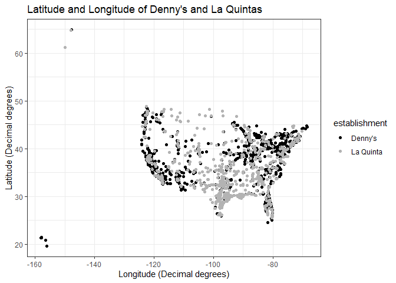
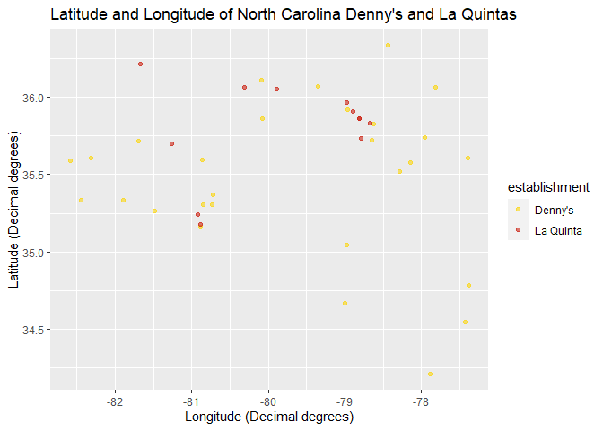
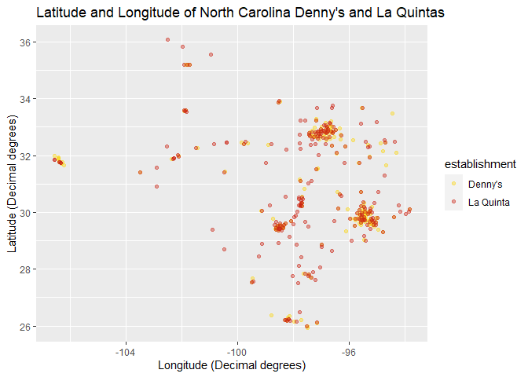

Lab 04 - La Quinta is Spanish for next to Denny’s, Pt. 1
================
Lindley
02/15/2021

### Load packages and data

``` r
library(tidyverse) 
#install.packages("wesanderson")
library(wesanderson)
```

``` r
states <- read_csv("data/states.csv")
load("G:\\My Drive\\DataScience\\Lab_04\\data\\dennys.rda")
load("G:\\My Drive\\DataScience\\Lab_04\\data\\laquinta.rda")
```

### Exercise 1

``` r
glimpse(dennys)
```

    ## Observations: 1,643
    ## Variables: 6
    ## $ address   <chr> "2900 Denali", "3850 Debarr Road", "1929 Airport Way", "2...
    ## $ city      <chr> "Anchorage", "Anchorage", "Fairbanks", "Auburn", "Birming...
    ## $ state     <chr> "AK", "AK", "AK", "AL", "AL", "AL", "AL", "AL", "AL", "AL...
    ## $ zip       <chr> "99503", "99508", "99701", "36849", "35207", "35294", "35...
    ## $ longitude <dbl> -149.8767, -149.8090, -147.7600, -85.4681, -86.8317, -86....
    ## $ latitude  <dbl> 61.1953, 61.2097, 64.8366, 32.6033, 33.5615, 33.5007, 34....

There are 1,643 observation and 6 columns. Each observation represents a
particular dennys.

### Exercise 2

``` r
glimpse(laquinta)
```

    ## Observations: 909
    ## Variables: 6
    ## $ address   <chr> "793 W. Bel Air Avenue", "3018 CatClaw Dr", "3501 West La...
    ## $ city      <chr> "\nAberdeen", "\nAbilene", "\nAbilene", "\nAcworth", "\nA...
    ## $ state     <chr> "MD", "TX", "TX", "GA", "OK", "TX", "AG", "TX", "NM", "NM...
    ## $ zip       <chr> "21001", "79606", "79601", "30102", "74820", "75254", "20...
    ## $ longitude <dbl> -76.18846, -99.77877, -99.72269, -84.65609, -96.63652, -9...
    ## $ latitude  <dbl> 39.52322, 32.41349, 32.49136, 34.08204, 34.78180, 32.9516...

There are 909 observations and 6 variables. Each observation is a
particular la quinta.

### Exercise 3

There are no dennys outside the US. There are la quintas outside the US
(Mexico, New Zealand, Honduras, Turkey, Chile, Columbia, and Canada).

### Exercise 4

One way that might be complicated is determining the latitude and
longitude limits of the united states and limiting the data set to just
those that fit within those limits. Another way (and I think this is the
one we’re doing) is to have a list of the states and check to see if the
state values of laquinta and dennys match that list. Any that don’t are
locations outside the united states.

### Exercise 5

``` r
dennys %>%
  filter(!(state %in% states$abbreviation))
```

    ## # A tibble: 0 x 6
    ## # ... with 6 variables: address <chr>, city <chr>, state <chr>, zip <chr>,
    ## #   longitude <dbl>, latitude <dbl>

This confirms what I saw on the website: no dennys outside the US.

### Exercise 6

``` r
dennys <- dennys %>%
  mutate(country = "United States")
```

### Exercise 7

``` r
laquinta %>%
  filter(!(state %in% states$abbreviation))
```

    ## # A tibble: 14 x 6
    ##    address                     city               state zip   longitude latitude
    ##    <chr>                       <chr>              <chr> <chr>     <dbl>    <dbl>
    ##  1 Carretera Panamericana Sur~ "\nAguascalientes" AG    20345    -102.     21.8 
    ##  2 Av. Tulum Mza. 14 S.M. 4 L~ "\nCancun"         QR    77500     -86.8    21.2 
    ##  3 Ejercito Nacional 8211      "Col\nPartido Igl~ CH    32528    -106.     31.7 
    ##  4 Blvd. Aeropuerto 4001       "Parque Industria~ NL    66600    -100.     25.8 
    ##  5 Carrera 38 # 26-13 Avenida~ "\nMedellin Colom~ ANT   0500~     -75.6     6.22
    ##  6 AV. PINO SUAREZ No. 1001    "Col. Centro\nMon~ NL    64000    -100.     25.7 
    ##  7 Av. Fidel Velazquez #3000 ~ "\nMonterrey"      NL    64190    -100.     25.7 
    ##  8 63 King Street East         "\nOshawa"         ON    L1H1~     -78.9    43.9 
    ##  9 Calle Las Torres-1 Colonia~ "\nPoza Rica"      VE    93210     -97.4    20.6 
    ## 10 Blvd. Audi N. 3 Ciudad Mod~ "\nSan Jose Chiap~ PU    75010     -97.8    19.2 
    ## 11 Ave. Zeta del Cochero No 4~ "Col. ReservaTerr~ PU    72810     -98.2    19.0 
    ## 12 Av. Benito Juarez 1230 B (~ "\nSan Luis Potos~ SL    78399    -101.     22.1 
    ## 13 Blvd. Fuerza Armadas        "contiguo Mall La~ FM    11101     -87.2    14.1 
    ## 14 8640 Alexandra Rd           "\nRichmond"       BC    V6X1~    -123.     49.2

Yes, I just spent the past hour trying to find the perfect data set of
global postal codes to make a code to find country by postal code, and I
failed to find one that was suitable. I’m settling for just googling it.
Oh well.

  - AG = Mexico
  - QR = Mexico
  - CH = Mexico
  - NL = Mexico
  - ANT = Colombia
  - ON = Canada
  - VE = Mexico
  - PU = Mexico
  - SL = Mexico
  - FM = Honduras
  - BC = Canada

### Exercise 8

``` r
laquinta <- laquinta %>%
  mutate(country = case_when(
    state %in% state.abb     ~ "United States",
    state %in% c("AG", "QR", "CH", "NL", "VE", "PU", "SL") ~ "Mexico",
    state %in% c("ON", "BC") ~ "Canada",
    state == "ANT"           ~ "Colombia",
    state == "FM"            ~ "Honduras"
  )) %>%
  filter(country == "United States")
```

### Exercise 9

``` r
dennys %>%
  count(state) %>%
  arrange(desc(n))
```

    ## # A tibble: 51 x 2
    ##    state     n
    ##    <chr> <int>
    ##  1 CA      403
    ##  2 TX      200
    ##  3 FL      140
    ##  4 AZ       83
    ##  5 IL       56
    ##  6 NY       56
    ##  7 WA       49
    ##  8 OH       44
    ##  9 MO       42
    ## 10 PA       40
    ## # ... with 41 more rows

California has the most dennys (403). Delaware has the least number of
dennys (1).

``` r
laquinta %>%
  count(state) %>%
  arrange(desc(n))
```

    ## # A tibble: 48 x 2
    ##    state     n
    ##    <chr> <int>
    ##  1 TX      237
    ##  2 FL       74
    ##  3 CA       56
    ##  4 GA       41
    ##  5 TN       30
    ##  6 OK       29
    ##  7 LA       28
    ##  8 CO       27
    ##  9 NM       19
    ## 10 NY       19
    ## # ... with 38 more rows

Texas has the most la quintas (237) and Maine has the least number of la
quintas (1). If Mitch Hedburg is right and la quintas and dennys were
paired, I think you’d expect them to have the highest and lowest numbers
in the same states.

### Exercise 10

``` r
dennys %>%
  count(state) %>%
  inner_join(states, by = c("state" = "abbreviation")) %>%
  mutate(per_square_mile = n/(area/1000)) %>%
  arrange(desc(per_square_mile))
```

    ## # A tibble: 51 x 5
    ##    state     n name                     area per_square_mile
    ##    <chr> <int> <chr>                   <dbl>           <dbl>
    ##  1 DC        2 District of Columbia     68.3          29.3  
    ##  2 RI        5 Rhode Island           1545.            3.24 
    ##  3 CA      403 California           163695.            2.46 
    ##  4 CT       12 Connecticut            5543.            2.16 
    ##  5 FL      140 Florida               65758.            2.13 
    ##  6 MD       26 Maryland              12406.            2.10 
    ##  7 NJ       10 New Jersey             8723.            1.15 
    ##  8 NY       56 New York              54555.            1.03 
    ##  9 IN       37 Indiana               36420.            1.02 
    ## 10 OH       44 Ohio                  44826.            0.982
    ## # ... with 41 more rows

D.C. has the most dennys per thousand square miles (29.3). Alaska has
the fewest dennys per thousand square mile (.005). This makes sense
because D.C. is the smallest area on the list, which makes the
denominator \< 1. Also, Alaska is super large (I think it’s the biggest
state) and has very few dennys.

``` r
laquinta %>%
  count(state) %>%
  inner_join(states, by = c("state" = "abbreviation")) %>%
  mutate(per_square_mile = n/(area/1000)) %>%
  arrange(desc(per_square_mile))
```

    ## # A tibble: 48 x 5
    ##    state     n name             area per_square_mile
    ##    <chr> <int> <chr>           <dbl>           <dbl>
    ##  1 RI        2 Rhode Island    1545.           1.29 
    ##  2 FL       74 Florida        65758.           1.13 
    ##  3 CT        6 Connecticut     5543.           1.08 
    ##  4 MD       13 Maryland       12406.           1.05 
    ##  5 TX      237 Texas         268596.           0.882
    ##  6 TN       30 Tennessee      42144.           0.712
    ##  7 GA       41 Georgia        59425.           0.690
    ##  8 NJ        5 New Jersey      8723.           0.573
    ##  9 MA        6 Massachusetts  10554.           0.568
    ## 10 LA       28 Louisiana      52378.           0.535
    ## # ... with 38 more rows

Rhode island has the most la quintas per thousand square mile (1.3). The
same reasoning as for D.C. above holds for Rhode Island. Alaska has the
fewest la quintas per thousand square mile (0.003) because of the reason
I gave above.

``` r
dennys <- dennys %>%
  mutate(establishment = "Denny's")
laquinta <- laquinta %>%
  mutate(establishment = "La Quinta")
```

``` r
dn_lq <- bind_rows(dennys, laquinta)
```

``` r
ggplot(dn_lq, mapping = aes(x = longitude, y = latitude, color = establishment)) +
  geom_point() +
  labs(title = "Latitude and Longitude of Denny's and La Quintas", x = "Longitude (Decimal degrees)", y = "Latitude (Decimal degrees)") +
    scale_colour_grey(start = 0, end = .7) +
  theme_bw()
```

<!-- -->

### Exercise 11

``` r
dn_lq %>%
  filter(state == "NC") %>%
  ggplot(mapping = aes(x = longitude, y = latitude, color = establishment)) +
  geom_point(alpha = .6) +
  labs(title = "Latitude and Longitude of North Carolina Denny's and La Quintas", x = "Longitude (Decimal degrees)", y = "Latitude (Decimal degrees)") +
   scale_color_manual(values = wes_palette("BottleRocket2", n = 2))
```

<!-- -->

While there are some la quintas that are near dennys (particularly
between longitude -79 and -78 and around -81), there are la quintas not
next to dennys. For example the point of 36.5 latitude is nowhere near a
dennys. Even so, it seems to be more common for a la quinta to be near a
dennys than not.

``` r
dn_lq %>%
  filter(state == "TX") %>%
  ggplot(mapping = aes(x = longitude, y = latitude, color = establishment)) +
  geom_point(alpha = .4) +
  labs(title = "Latitude and Longitude of North Carolina Denny's and La Quintas", x = "Longitude (Decimal degrees)", y = "Latitude (Decimal degrees)") +
   scale_color_manual(values = wes_palette("BottleRocket2", n = 2))
```

<!-- -->

The claim seems to be more true here. There are three main clusters of
la quintas and dennys overlapping. Even outside the cluters, the la
quinta and dennys points are close. There are some la quintas at the
35-36 latitude without dennys, but that is not as common as the two
being paired. So, I think, generally, the Mitch Hedburg joke is true.
